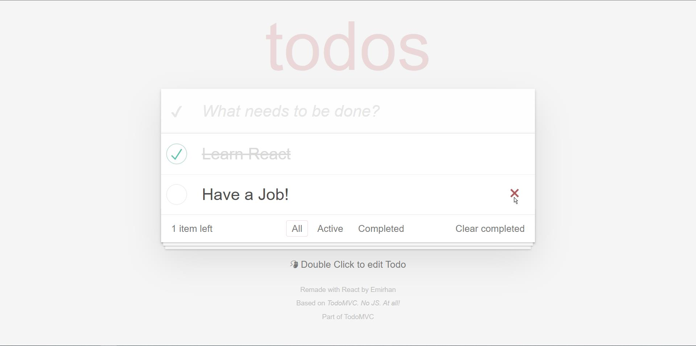

# To-Do App With React/Redux


This project is based on [TodoMVC. No JS. At all!](https://codepen.io/dmitrysharabin/pen/MWgQNYZ) 
and part of [TodoMVC](https://todomvc.com)

Remade with React and Redux Toolkit.

_( back-end is currently in progress.
you can test it on **todo-app-with-be** branch )_

### In this project, you can:
* Add
* Delete selected
* Toggle selected
* Toggle all
* Clear completed
* Update
* and Filter todos
* it also show you different options according to todo counts.


## Tech Stack 
```
* React
* reduxjs/toolkit
```

## Preview
 

---

## Available Scripts

In the project directory, you can run:

### `npm run dev`

Runs the app in the development mode.\
Open [http://127.0.0.1:5173](http://127.0.0.1:5173) to view it in your browser.

## For **Back-End**

In the **api** directory:

`npm run server`

It starts server on **7000** port.

## Learn More
You can learn more in the [Vite documentation](https://vitejs.dev/guide).
